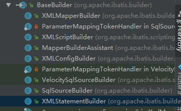

### mybatis 源码之配置文件解析

#### 准备工作参考【test/yyb/useful/start02】
由于本次只研究mybatis配置文件的加载过程，所以配置了一份最全的配置文件，但无法保证sql语句功能的正常运行。

####编写测试方法
```
  @Test
    public void test() throws IOException {
        String resource = "yyb/useful/start02/mybatis-config.xml";
        InputStream inputStream = Resources.getResourceAsStream(resource);
        SqlSessionFactory sqlSessionFactory = new SqlSessionFactoryBuilder().build(inputStream);
        SqlSession session = sqlSessionFactory.openSession();
    }
```
#### 读取配置文件
MyBatis 包含一个名叫 Resources 的工具类，它包含一些实用方法，可使从 classpath 或其他位置加载资源文件更加容易。
```
InputStream inputStream = Resources.getResourceAsStream(resource);
```
层层深入后，最终来到【ClassLoaderWrapper.java】,其最终的实现代码为：
```
InputStream getResourceAsStream(String resource, ClassLoader[] classLoader) {
    for (ClassLoader cl : classLoader) {
      if (null != cl) {

        // try to find the resource as passed
        InputStream returnValue = cl.getResourceAsStream(resource);

        // now, some class loaders want this leading "/", so we'll add it and try again if we didn't find the resource
        if (null == returnValue) {
          returnValue = cl.getResourceAsStream("/" + resource);
        }

        if (null != returnValue) {
          return returnValue;
        }
      }
    }
    return null;
  }
```
可以看到，最终仍然调用的是classLoader的getResourceAsStream方法。
#### 解析配置文件
读取mybatis的配置文件后，会把读取的流交给SqlSessionFactoryBuilder的build方法，SqlSessionFactoryBuilder类的职责就是创建SqlSessionFactory对象，里面全是build方法重载，所以创建SqlSessionFactory的方式有很多种，接下来跟踪build方法，发现最终调用的是如下build方法：
```
    public SqlSessionFactory build(InputStream inputStream, String environment, Properties properties) {
      try {
        XMLConfigBuilder parser = new XMLConfigBuilder(inputStream, environment, properties);
        return build(parser.parse());
      } catch (Exception e) {
        throw ExceptionFactory.wrapException("Error building SqlSession.", e);
      } finally {
        ErrorContext.instance().reset();
        try {
          inputStream.close();
        } catch (IOException e) {
          // Intentionally ignore. Prefer previous error.
        }
      }
    }
```
可以发现，该类并没干实事，而是把解析xml的工作转交给了XMLConfigBuilder，下面来看看XMLConfigBuilder的构造方法：
```
  public XMLConfigBuilder(InputStream inputStream, String environment, Properties props) {
    this(new XPathParser(inputStream, true, props, new XMLMapperEntityResolver()), environment, props);
  }
```
可以看到，在创建XMLConfigBuilder对象的时候，又创建了XPathParser对象，而XPathParse对象的创建又需要以及XMLMapperEntityResolver对象，然后调用了重载的构造方法，我们看看创建XPathParser又做了什么
```
  public XPathParser(InputStream inputStream, boolean validation, Properties variables, EntityResolver entityResolver) {
    commonConstructor(validation, variables, entityResolver);
    this.document = createDocument(new InputSource(inputStream));
  }
  
  private void commonConstructor(boolean validation, Properties variables, EntityResolver entityResolver) {
      this.validation = validation;
      this.entityResolver = entityResolver;
      this.variables = variables;
      XPathFactory factory = XPathFactory.newInstance();
      this.xpath = factory.newXPath();
    }
    
  private Document createDocument(InputSource inputSource) {
        // important: this must only be called AFTER common constructor
        try {
          DocumentBuilderFactory factory = DocumentBuilderFactory.newInstance();
          factory.setValidating(validation);
    
          factory.setNamespaceAware(false);
          factory.setIgnoringComments(true);
          factory.setIgnoringElementContentWhitespace(false);
          factory.setCoalescing(false);
          factory.setExpandEntityReferences(true);
    
          DocumentBuilder builder = factory.newDocumentBuilder();
          builder.setEntityResolver(entityResolver);
          builder.setErrorHandler(new ErrorHandler() {
            @Override
            public void error(SAXParseException exception) throws SAXException {
              throw exception;
            }
    
            @Override
            public void fatalError(SAXParseException exception) throws SAXException {
              throw exception;
            }
    
            @Override
            public void warning(SAXParseException exception) throws SAXException {
            }
          });
          return builder.parse(inputSource);
        } catch (Exception e) {
          throw new BuilderException("Error creating document instance.  Cause: " + e, e);
        }
      }
```
可以看到，构造函数中主要是初始化XpathParser的成员变量，XPathParser这个类使用XPath技术封装的用于解析xml的工具类，如果想进一步了解，可以看看[这篇文章](https://www.cnblogs.com/eternalisland/p/6287044.html)。XPathParser创建好后，接下来继续看XMLConfigBuilder的构造函数：
```
  private XMLConfigBuilder(XPathParser parser, String environment, Properties props) {
    super(new Configuration());
    ErrorContext.instance().resource("SQL Mapper Configuration");
    this.configuration.setVariables(props);
    this.parsed = false;
    this.environment = environment;
    this.parser = parser;
  }
```
这里首先执行“super(new Configuration());”，可以看到XMLConfigBuilder继承自BaseBuilder，
,BaseBuilder有很多的子类，所以可以重点分析下:
```java
public abstract class BaseBuilder {
  //mybatis配置对象，用于保存xml解析后的数据  
  protected final Configuration configuration;
  //类型别名注册对象
  protected final TypeAliasRegistry typeAliasRegistry;
  //TypeHandler注册对象
  protected final TypeHandlerRegistry typeHandlerRegistry;

  public BaseBuilder(Configuration configuration) {
    this.configuration = configuration;
    this.typeAliasRegistry = this.configuration.getTypeAliasRegistry();
    this.typeHandlerRegistry = this.configuration.getTypeHandlerRegistry();
  }
  //用于获取配置对象
  public Configuration getConfiguration() {
    return configuration;
  }
  //正则，表达式为空就用默认值  
  protected Pattern parseExpression(String regex, String defaultValue) {
    return Pattern.compile(regex == null ? defaultValue : regex);
  }
  //String类型转换 为布尔类型，为空则为默认值 
  protected Boolean booleanValueOf(String value, Boolean defaultValue) {
    return value == null ? defaultValue : Boolean.valueOf(value);
  }
//String类型转换 为Integer类型，为空则为默认值
  protected Integer integerValueOf(String value, Integer defaultValue) {
    return value == null ? defaultValue : Integer.valueOf(value);
  }
//把逗号分隔的字符串转为HashSet，为空则为默认值
  protected Set<String> stringSetValueOf(String value, String defaultValue) {
    value = value == null ? defaultValue : value;
    return new HashSet<>(Arrays.asList(value.split(",")));
  }
//根据别名获取对应的JdbcType，JdbcType是一个枚举，数据库的字段类型
  protected JdbcType resolveJdbcType(String alias) {
    if (alias == null) {
      return null;
    }
    try {
      return JdbcType.valueOf(alias);
    } catch (IllegalArgumentException e) {
      throw new BuilderException("Error resolving JdbcType. Cause: " + e, e);
    }
  }
//根据别名获取对应的ResultSetType，
//FORWARD_ONLY(ResultSet.TYPE_FORWARD_ONLY),只允许结果集的游标向下移动。
//下面两个都能够实现任意的前后滚动，使用各种移动的ResultSet指针的方法。二者的区别在于前者对于修改不敏感，而后者对于修改敏感。
//SCROLL_INSENSITIVE(ResultSet.TYPE_SCROLL_INSENSITIVE),
//SCROLL_SENSITIVE(ResultSet.TYPE_SCROLL_SENSITIVE);
  protected ResultSetType resolveResultSetType(String alias) {
    if (alias == null) {
      return null;
    }
    try {
      return ResultSetType.valueOf(alias);
    } catch (IllegalArgumentException e) {
      throw new BuilderException("Error resolving ResultSetType. Cause: " + e, e);
    }
  }
//根据别名获取对应的ParameterMode
//  IN, OUT, INOUT,存储过程的参数类型
  protected ParameterMode resolveParameterMode(String alias) {
    if (alias == null) {
      return null;
    }
    try {
      return ParameterMode.valueOf(alias);
    } catch (IllegalArgumentException e) {
      throw new BuilderException("Error resolving ParameterMode. Cause: " + e, e);
    }
  }
//根据别名解析类之后，只是加载了类，并未创建实例，可以调用该方法创建实例
  protected Object createInstance(String alias) {
    Class<?> clazz = resolveClass(alias);
    if (clazz == null) {
      return null;
    }
    try {
      return resolveClass(alias).newInstance();
    } catch (Exception e) {
      throw new BuilderException("Error creating instance. Cause: " + e, e);
    }
  }
  protected <T> Class<? extends T> resolveClass(String alias) {
    if (alias == null) {
      return null;
    }
    try {
      return resolveAlias(alias);
    } catch (Exception e) {
      throw new BuilderException("Error resolving class. Cause: " + e, e);
    }
  }
//根据别名解析TypeHandler
  protected TypeHandler<?> resolveTypeHandler(Class<?> javaType, String typeHandlerAlias) {
    if (typeHandlerAlias == null) {
      return null;
    }
    Class<?> type = resolveClass(typeHandlerAlias);
    //判断该TypeHandler是否实现了TypeHandler接口，如果没实现，抛异常
    if (type != null && !TypeHandler.class.isAssignableFrom(type)) {
      throw new BuilderException("Type " + type.getName() + " is not a valid TypeHandler because it does not implement TypeHandler interface");
    }
    @SuppressWarnings("unchecked") // already verified it is a TypeHandler
    Class<? extends TypeHandler<?>> typeHandlerType = (Class<? extends TypeHandler<?>>) type;
    return resolveTypeHandler(javaType, typeHandlerType);
  }
  //获取某个typeHanlder实例，首先会从allTypeHandlersMap中取，如果不存在则创建一个
  protected TypeHandler<?> resolveTypeHandler(Class<?> javaType, Class<? extends TypeHandler<?>> typeHandlerType) {
    if (typeHandlerType == null) {
      return null;
    }
    // javaType ignored for injected handlers see issue #746 for full detail
    TypeHandler<?> handler = typeHandlerRegistry.getMappingTypeHandler(typeHandlerType);
    if (handler == null) {
      // not in registry, create a new one
      handler = typeHandlerRegistry.getInstance(javaType, typeHandlerType);
    }
    return handler;
  }

  protected <T> Class<? extends T> resolveAlias(String alias) {
    return typeAliasRegistry.resolveAlias(alias);
  }
  //下面的代码时typeAliasRegistry类的resolveAlias()方法
  //逻辑很简单，就是判断typeAliases这个map里是否存在别名，存在直接返回，不存在就加载类并返回
   public <T> Class<T> resolveAlias(String string) {
      try {
        if (string == null) {
          return null;
        }
        // issue #748
        String key = string.toLowerCase(Locale.ENGLISH);
        Class<T> value;
        if (typeAliases.containsKey(key)) {
          value = (Class<T>) typeAliases.get(key);
        } else {
            //下面这句代码层层深入后发现，最终就是这句话： Class<?> c = Class.forName(name, true, cl);
          value = (Class<T>) Resources.classForName(string);
        }
        return value;
      } catch (ClassNotFoundException e) {
        throw new TypeException("Could not resolve type alias '" + string + "'.  Cause: " + e, e);
      }
    }
}

```
下面来分析一下Configuration类的构造函数：
```
  public Configuration() {
        //transactionManager type="JDBC",使用JDBC的事务管理机制：即利用java.sql.Connection对象完成对事务的提交（commit()）、回滚（rollback()）、关闭（close()）等
        typeAliasRegistry.registerAlias("JDBC", JdbcTransactionFactory.class);
        //transactionManager type="MANAGED",使用MANAGED的事务管理机制：这种机制MyBatis自身不会去实现事务管理，而是让程序的容器如（JBOSS，Weblogic）来实现对事务的管理
        typeAliasRegistry.registerAlias("MANAGED", ManagedTransactionFactory.class);
    
        // <dataSource type="JNDI"> mybaties会从在应用服务器向配置好的JNDI数据源DataSource获取数据库连接。在生产环境中优先考虑这种方式。
        typeAliasRegistry.registerAlias("JNDI", JndiDataSourceFactory.class);
        //<dataSource type="POOLED">mybaties会创建一个数据库连接池，连接池的一个连接将会被用作数据库操作。一旦数据库操作完成，
        // mybaties会将此连接返回给连接池。在开发或测试环境中经常用到此方式。
        typeAliasRegistry.registerAlias("POOLED", PooledDataSourceFactory.class);
        //<dataSource type="UNPOOLED">mybaties会为每一个数据库操作创建一个新的连接，并关闭它。该方式适用于只有小规模数量并发用户的简单应用程序上。
        typeAliasRegistry.registerAlias("UNPOOLED", UnpooledDataSourceFactory.class);
    
        //以下为缓存策略，在mapper配置文件中使用，eviction是缓存的淘汰算法，可选值有"LRU"、"FIFO"、"SOFT"、"WEAK"，缺省值是LRU
        //PERPETUAL为默认的缓存方式，可以自定义成其他的
        typeAliasRegistry.registerAlias("PERPETUAL", PerpetualCache.class);
        //FIFO：先进先出，按对象进入缓存的顺序来移除
        typeAliasRegistry.registerAlias("FIFO", FifoCache.class);
        //LRU：最近最少使用，移除最长时间不被使用的对象，默认策略
        typeAliasRegistry.registerAlias("LRU", LruCache.class);
        //SOFT：软引用，移除基于垃圾回收器状态和软引用规则的对象
        typeAliasRegistry.registerAlias("SOFT", SoftCache.class);
        //WEAK：弱引用，更积极地移除基于垃圾收集器状态和弱引用规则的对象
        typeAliasRegistry.registerAlias("WEAK", WeakCache.class);
    
        //<databaseIdProvider type="DB_VENDOR" />
        // MyBatis 可以根据不同的数据库厂商执行不同的语句，这种多厂商的支持是基于映射语句中的 databaseId 属性。 
        // MyBatis 会加载不带 databaseId 属性和带有匹配当前数据库 databaseId 属性的所有语句。 
        // 如果同时找到带有 databaseId 和不带 databaseId 的相同语句，则后者会被舍弃。 
        // 为支持多厂商特性只要在 mybatis-config.xml 文件中加入 databaseIdProvider 即可
        typeAliasRegistry.registerAlias("DB_VENDOR", VendorDatabaseIdProvider.class);
    
        //XMLLanguageDriver:用于创建动态、静态SqlSource。
        typeAliasRegistry.registerAlias("XML", XMLLanguageDriver.class);
        //RawLanguageDriver:在确保只有静态sql时，可以使用，不得含有任何动态sql的内容
        typeAliasRegistry.registerAlias("RAW", RawLanguageDriver.class);
        
        //配置日志  <setting name="logImpl" value="LOG4J"/>
        typeAliasRegistry.registerAlias("SLF4J", Slf4jImpl.class);
        typeAliasRegistry.registerAlias("COMMONS_LOGGING", JakartaCommonsLoggingImpl.class);
        typeAliasRegistry.registerAlias("LOG4J", Log4jImpl.class);
        typeAliasRegistry.registerAlias("LOG4J2", Log4j2Impl.class);
        typeAliasRegistry.registerAlias("JDK_LOGGING", Jdk14LoggingImpl.class);
        typeAliasRegistry.registerAlias("STDOUT_LOGGING", StdOutImpl.class);
        typeAliasRegistry.registerAlias("NO_LOGGING", NoLoggingImpl.class);
        
        //  <setting name="proxyFactory" value="CGLIB"/>  Mybatis延迟加载是通过动态代理完成的
        typeAliasRegistry.registerAlias("CGLIB", CglibProxyFactory.class);
        typeAliasRegistry.registerAlias("JAVASSIST", JavassistProxyFactory.class);
        
        ///把XMLLanguageDriver加到languageRegistry对象的map字段里，并设置languageRegistry对象的defaultDriverClass字段为XMLLanguageDriver
        languageRegistry.setDefaultDriverClass(XMLLanguageDriver.class);
        //把RawLanguageDriver加到languageRegistry对象的map字段里
        languageRegistry.register(RawLanguageDriver.class);
      }
  //可以看到在初始化Configuration对象的时候，注册了很多的别名，这些别名在Configuration配置文件或者mapper中使用，
  // 但是这些别名保存在哪里了呢？通过查看Configuration类，发现有下面这句话，
  protected final TypeAliasRegistry typeAliasRegistry = new TypeAliasRegistry();
  //所以在Configuration构造函数执行之前typeAliasRegistry创建好了，在跟踪 typeAliasRegistry.registerAlias()方法
   public void registerAlias(String alias, Class<?> value) {
     if (alias == null) {
       throw new TypeException("The parameter alias cannot be null");
     }
     // issue #748
     String key = alias.toLowerCase(Locale.ENGLISH);
     if (TYPE_ALIASES.containsKey(key) && TYPE_ALIASES.get(key) != null && !TYPE_ALIASES.get(key).equals(value)) {
       throw new TypeException("The alias '" + alias + "' is already mapped to the value '" + TYPE_ALIASES.get(key).getName() + "'.");
     }
     TYPE_ALIASES.put(key, value);
   }
   //可以看到，别名放到了TYPE_ALIASES变量中，也就是保存在一个HashMap里。
  private final Map<String, Class<?>> TYPE_ALIASES = new HashMap<String, Class<?>>();
  
//接下来看看XMLConfigBuilder的parse方法，看看是如何解析配置文件到Configuration对象的各个字段里的
  public Configuration parse() {
    if (parsed) {
      throw new BuilderException("Each XMLConfigBuilder can only be used once.");
    }
    //该对象创建的时候设置配置文件未解析过，然后解析之后就设置为已解析，防止重复解析。
    parsed = true;
    //配置文件的根节点为configuration
    parseConfiguration(parser.evalNode("/configuration"));
    return configuration;
  }

  private void parseConfiguration(XNode root) {
    try {
      //根据传递的参数就知道解析的就是配置文件的节点了
      propertiesElement(root.evalNode("properties"));
      Properties settings = settingsAsProperties(root.evalNode("settings"));
      loadCustomVfs(settings);
      typeAliasesElement(root.evalNode("typeAliases"));
      pluginElement(root.evalNode("plugins"));
      objectFactoryElement(root.evalNode("objectFactory"));
      objectWrapperFactoryElement(root.evalNode("objectWrapperFactory"));
      reflectorFactoryElement(root.evalNode("reflectorFactory"));
      settingsElement(settings);
      // read it after objectFactory and objectWrapperFactory issue #631
      environmentsElement(root.evalNode("environments"));
      databaseIdProviderElement(root.evalNode("databaseIdProvider"));
      typeHandlerElement(root.evalNode("typeHandlers"));
      mapperElement(root.evalNode("mappers"));
    } catch (Exception e) {
      throw new BuilderException("Error parsing SQL Mapper Configuration. Cause: " + e, e);
    }
  }
```
接下来逐个分析解析的过程，先来看看propertiesElement:

我们可以在配置文件做如下配置：
```xml
    <properties resource="prop.properties"><!-- 也可以配置url,但url和resource只能存在一个 -->
        <property name="username" value="username"/>
        <property name="password" value="cyy"/>
        <property name="test" value="test"/>
    </properties>
```
 ```
private void propertiesElement(XNode context) throws Exception {
    if (context != null) {
    //获取properties下的property，也就是username，password，test，保存到defaults中
      Properties defaults = context.getChildrenAsProperties();
      //获取properties的resource属性的值
      String resource = context.getStringAttribute("resource");
      //获取properties的url属性的值
      String url = context.getStringAttribute("url");
      //url和resource只能存在一个,否则会抛异常
      if (resource != null && url != null) {
        throw new BuilderException("The properties element cannot specify both a URL and a resource based property file reference.  Please specify one or the other.");
      }
      //把读取到的数据再次放到defaults中，此处如果配置重复了，后放进来的会覆盖之前的
      if (resource != null) {
        defaults.putAll(Resources.getResourceAsProperties(resource));
      } else if (url != null) {
        defaults.putAll(Resources.getUrlAsProperties(url));
      }
      //获取之前的配置信息，如果有的话，先取出来加到defaults中，以防被覆盖掉
      Properties vars = configuration.getVariables();
      if (vars != null) {
        defaults.putAll(vars);
      }
      //把配置信息给XPathParser和Configuration对象各保存一份
      parser.setVariables(defaults);
      configuration.setVariables(defaults);
    }
  }

```

总结：先读取配置文件，然后解析，解析之前先把configuration初始化好，然后把解析的数据设置到该对象对应的各个属性中。